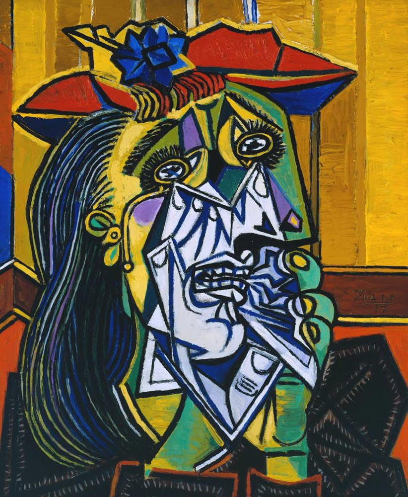

## Fast Style Transfer in [TensorFlow](https://github.com/tensorflow/tensorflow)

This is us trying to perform style transfer on our choice of paintings based on the implementation by [Engstrom](https://github.com/lengstrom/fast-style-transfer). 

## Image Stylization

We added two style of paintings: A chinese painting and Picasso's Weeping woman painting. 

After training the models, we stylized a photo of Taj Mahal using Picasso's painting. 

<p align = 'center'>


<a href = 'output_files/picasso/1_8278.png'></a>
</p>

We also stylized a photo of of Cave2 using a Chinese painting. 

<p align = 'center'>


<a href = 'output_files/chinese/0_5000.png'></a>
</p>


## Implementation Details
Our implementation uses TensorFlow to train a fast style transfer network. We use roughly the same transformation network as described in Johnson, except that batch normalization is replaced with Ulyanov's instance normalization, and the scaling/offset of the output `tanh` layer is slightly different. We use a loss function close to the one described in Gatys, using VGG19 instead of VGG16 and typically using "shallower" layers than in Johnson's implementation (e.g. we use `relu1_1` rather than `relu1_2`). Empirically, this results in larger scale style features in transformations.

## Documentation
### Training Style Transfer Networks
Use `style.py` to train a new style transfer network. Run `python style.py` to view all the possible parameters. Training takes 4-6 hours on a Maxwell Titan X. [More detailed documentation here](docs.md#style). **Before you run this, you should run `setup.sh`**. Example usage:

    python style.py --style path/to/style/img.jpg \
      --checkpoint-dir checkpoint/path \
      --test path/to/test/img.jpg \
      --test-dir path/to/test/dir \
      --content-weight 1.5e1 \
      --checkpoint-iterations 1000 \
      --batch-size 20

### Evaluating Style Transfer Networks
Use `evaluate.py` to evaluate a style transfer network. Run `python evaluate.py` to view all the possible parameters. Evaluation takes 100 ms per frame (when batch size is 1) on a Maxwell Titan X. [More detailed documentation here](docs.md#evaluate). Takes several seconds per frame on a CPU. **Models for evaluation are [located here](https://drive.google.com/drive/folders/0B9jhaT37ydSyRk9UX0wwX3BpMzQ?usp=sharing)**. Example usage:

    python evaluate.py --checkpoint path/to/style/model.ckpt \
      --in-path dir/of/test/imgs/ \
      --out-path dir/for/results/


### Requirements
You will need the following to run the above:
- TensorFlow 0.11.0
- Python 2.7.9, Pillow 3.4.2, scipy 0.18.1, numpy 1.11.2
- If you want to train (and don't want to wait for 4 months):
  - A decent GPU
  - All the required NVIDIA software to run TF on a GPU (cuda, etc)
- ffmpeg 3.1.3 if you want to stylize video

### References

Gatys' [A Neural Algorithm of Artistic Style](https://arxiv.org/abs/1508.06576), 
Johnson's [Perceptual Losses for Real-Time Style Transfer and Super-Resolution](http://cs.stanford.edu/people/jcjohns/eccv16/), 
Ulyanov's [Instance Normalization](https://arxiv.org/abs/1607.08022). 

### Citation
```
  @misc{engstrom2016faststyletransfer,
    author = {Logan Engstrom},
    title = {Fast Style Transfer},
    year = {2016},
    howpublished = {\url{https://github.com/lengstrom/fast-style-transfer/}},
    note = {commit xxxxxxx}
  }
```
### Attributions/Thanks
- This project could not have happened without the advice (and GPU access) given by [Anish Athalye](http://www.anishathalye.com/). 
  - The project also borrowed some code from Anish's [Neural Style](https://github.com/anishathalye/neural-style/)
- Some readme/docs formatting was borrowed from Justin Johnson's [Fast Neural Style](https://github.com/jcjohnson/fast-neural-style)
- The image of the Stata Center at the very beginning of the README was taken by [Juan Paulo](https://juanpaulo.me/)

### License
Copyright (c) 2016 Logan Engstrom. Contact me for commercial use (email: engstrom at my university's domain dot edu). Free for research/noncommercial use, as long as proper attribution is given and this copyright notice is retained.

